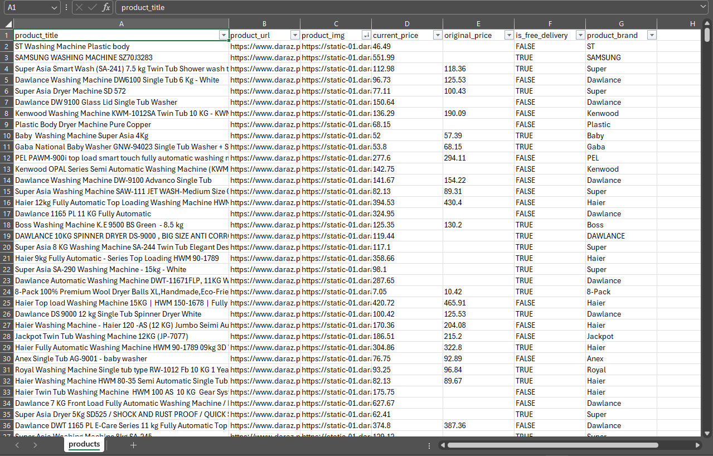

# Daraz Product Scraper
Daraz is a popular ecommerce platform in ASIA. This script scrapes product info (title, price, etc.) from Daraz by following category pages.

## Goal:
- Handle Dynamic Content rendering in a headless mode.
- Handle anti-bot services to bypass blocking
- Respects robots.txt guidelines
- Extracting Complex Product Listing Structure and Extract Dynamic Prices
- Implemented Data Validation like cleaning prices data and converting into Dollars($)
- Navigates to next page until reaches last page and handle pagination
- Implemented Download Delay to avoid server overloading.

## Needs:

Python 3 (Linux/Mac/WSL)

## Setup:

Open terminal and type:

```Bash
git clone https://github.com/seemab-yamin/daraz-product-scraper
cd daraz-product-scraper
pip install -r requirements.txt
playwright install --with-deps chromium
```

Run:
```Bash
python3 daraz_scraper.py {category_url}

# Example
python3 scraper.py https://www.daraz.pk/washers-dryers
```

## Pros: 
- Store Details logs for later debugging
- Can increase CONCURRENT_REQUESTS to initiate more instances to speed up things but will consume more resources.

## Cons:
- Browser based solutions are Memory expensive so should be used in specific use cases like: Bypass blocking, Load Dynamic Content, Perform Automation, etc

## Improvements:
- Need to add explicit time sleep or scroll as Images weren't fully rendered in the page source.

# Dataset Screenshot


## Resources:

- Scrapy: https://scrapy.org/
- Scrapy-Playwright: https://github.com/scrapy-plugins/scrapy-playwright
- Scrapy-Playwright Tutorial: https://scrapeops.io/python-scrapy-playbook/scrapy-playwright/